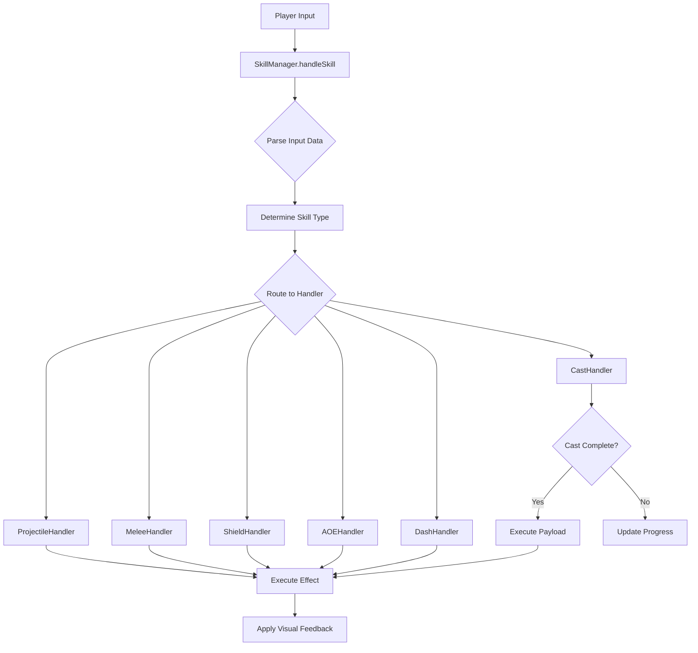

# Design Document: Ability System

## Overview

The Ability System is a comprehensive skill management framework for a multiplayer boss fight game supporting 8 character classes with 4 unique skills each (32 total abilities). The system is architected around 6 core mechanic archetypes that handle different input interactions and effect types:

- **PROJECTILE**: Linear moving entities with collision detection
- **MELEE**: Instant directional cone hit detection
- **CAST**: Charge-up abilities with payload execution
- **SHIELD**: Directional damage blocking
- **AOE**: Area effect abilities (self-centered or lobbed)
- **DASH/TELEPORT**: Rapid movement abilities

The design emphasizes a unified handler interface through the SkillManager, enabling consistent skill execution across all classes while maintaining flexibility for unique ability behaviors.

## Architecture

### High-Level Structure

```
SkillManager (Central Coordinator)
    ├── Input Handler (Process user input)
    ├── Mechanic Handlers
    │   ├── ProjectileHandler
    │   ├── MeleeHandler
    │   ├── CastHandler
    │   ├── ShieldHandler
    │   ├── AOEHandler
    │   └── DashHandler
    ├── Collision System
    ├── Effect System (Buffs/Debuffs)
    └── Visual Feedback System
```

### Design Principles

1. **Separation of Concerns**: Each mechanic archetype has its own handler
2. **Data-Driven Configuration**: All ability parameters stored in configuration objects
3. **Unified Interface**: Single entry point (handleSkill) for all ability execution
4. **Extensibility**: New abilities can be added by composing existing archetypes
5. **Performance**: Instant hit detection for melee, efficient collision checks for projectiles

### Execution Flow



## Components and Interfaces

### SkillManager

The central coordinator for all ability execution.

**Interface:**
```javascript
class SkillManager {
  /**
   * Main entry point for skill execution
   * @param {Scene} scene - The game scene
   * @param {Player} player - The player executing the skill
   * @param {number} skillIndex - Index of the skill (0-3 for S1-S4)
   * @param {InputData} inputData - User input information
   */
  handleSkill(scene, player, skillIndex, inputData)
  
  /**
   * Get skill configuration for a player's class and skill index
   * @param {string} className - The player's class name
   * @param {number} skillIndex - The skill index (0-3)
   * @returns {SkillConfig} The skill configuration
   */
  getSkillConfig(className, skillIndex)
  
  /**
   * Check if a skill is on cooldown
   * @param {Player} player - The player
   * @param {number} skillIndex - The skill index
   * @returns {boolean} True if on cooldown
   */
  isOnCooldown(player, skillIndex)
  
  /**
   * Start cooldown for a skill
   * @param {Player} player - The player
   * @param {number} skillIndex - The skill index
   * @param {number} duration - Cooldown duration in milliseconds
   */
  startCooldown(player, skillIndex, duration)
}
```

### InputData

Encapsulates user input information.

**Structure:**
```javascript
{
  action: 'START' | 'HOLD' | 'RELEASE',  // Input action type
  vector: { x: number, y: number },       // Normalized direction vector
  intensity: number                        // 0.0 to 1.0 for distance/power
}
```

### SkillConfig

Configuration object for each ability.

**Structure:**
```javascript
{
  name: string,              // Skill name (e.g., "Cleave")
  type: string,              // Archetype: PROJECTILE, MELEE, CAST, SHIELD, AOE, DASH
  subtype: string,           // Optional: AOE_SELF, AOE_LOBBED, TELEPORT
  cooldown: number,          // Cooldown in milliseconds
  
  // Type-specific parameters
  damage: number,            // Damage amount
  range: number,             // Maximum range
  speed: number,             // Movement speed (projectiles, dashes)
  radius: number,            // Effect radius (projectiles, AOE)
  angle: number,             // Cone angle in radians (melee)
  pierce: boolean,           // Can pass through enemies (projectiles)
  castTime: number,          // Cast duration in milliseconds
  arc: number,               // Shield arc width in radians
  duration: number,          // Effect duration (shields, buffs)
  distance: number,          // Dash/teleport distance
  
  // Cast-specific
  payload: SkillConfig,      // Ability executed on cast completion
  
  // Effect-specific
  effectType: string,        // DAMAGE, HEAL, BUFF, DEBUFF
  effectParams: object       // Effect-specific parameters
}
```

### ProjectileHandler

Handles projectile-based abilities.

**Interface:**
```javascript
class ProjectileHandler {
  /**
   * Spawn and initialize a projectile
   * @param {Scene} scene - The game scene
   * @param {Player} player - The player firing the projectile
   * @param {SkillConfig} config - Skill configuration
   * @param {Vector} direction - Normalized direction vector
   * @returns {Projectile} The spawned projectile entity
   */
  spawn(scene, player, config, direction)
  
  /**
   * Update projectile position and check collisions
   * @param {Projectile} projectile - The projectile to update
   * @param {number} deltaTime - Time since last update
   */
  update(projectile, deltaTime)
  
  /**
   * Handle projectile collision
   * @param {Projectile} projectile - The projectile
   * @param {Entity} target - The entity hit
   */
  onCollision(projectile, target)
}
```

**Projectile Entity:**
```javascript
{
  x: number,                 // Current X position
  y: number,                 // Current Y position
  vx: number,                // X velocity
  vy: number,                // Y velocity
  speed: number,             // Movement speed
  radius: number,            // Collision radius
  damage: number,            // Damage on hit
  range: number,             // Maximum travel distance
  distanceTraveled: number,  // Distance traveled so far
  pierce: boolean,           // Can pass through enemies
  owner: Player,             // Player who fired it
  sprite: Sprite             // Visual representation
}
```

### MeleeHandler

Handles instant melee cone attacks.

**Interface:**
```javascript
class MeleeHandler {
  /**
   * Execute melee attack with instant hit detection
   * @param {Scene} scene - The game scene
   * @param {Player} player - The player attacking
   * @param {SkillConfig} config - Skill configuration
   * @param {Vector} direction - Attack direction
   */
  execute(scene, player, config, direction)
  
  /**
   * Check if an entity is within the melee cone
   * @param {Player} player - The attacking player
   * @param {Entity} target - The potential target
   * @param {Vector} direction - Attack direction
   * @param {number} range - Attack range
   * @param {number} coneAngle - Cone angle in radians
   * @returns {boolean} True if target is hit
   */
  isInCone(player, target, direction, range, coneAngle)
  
  /**
   * Render visual effect for melee attack
   * @param {Scene} scene - The game scene
   * @param {Player} player - The attacking player
   * @param {Vector} direction - Attack direction
   * @param {SkillConfig} config - Skill configuration
   */
  renderEffect(scene, player, direction, config)
}
```

### CastHandler

Handles charge-up abilities with payload execution.

**Interface:**
```javascript
class CastHandler {
  /**
   * Start a cast
   * @param {Player} player - The player casting
   * @param {SkillConfig} config - Skill configuration
   */
  startCast(player, config)
  
  /**
   * Update cast progress
   * @param {Player} player - The player casting
   * @param {number} deltaTime - Time since last update
   * @returns {boolean} True if cast completed
   */
  updateCast(player, deltaTime)
  
  /**
   * Cancel an in-progress cast
   * @param {Player} player - The player casting
   */
  cancelCast(player)
  
  /**
   * Execute the payload ability on cast completion
   * @param {Scene} scene - The game scene
   * @param {Player} player - The player
   * @param {SkillConfig} payloadConfig - Payload skill configuration
   * @param {InputData} inputData - Input data from cast start
   */
  executePayload(scene, player, payloadConfig, inputData)
  
  /**
   * Render cast progress bar
   * @param {Player} player - The player casting
   */
  renderProgress(player)
}
```

**Cast State:**
```javascript
{
  active: boolean,           // Is cast in progress
  startTime: number,         // Timestamp when cast started
  castTime: number,          // Required cast duration
  config: SkillConfig,       // Skill being cast
  inputData: InputData,      // Input data from cast start
  progressBar: Sprite        // Visual progress indicator
}
```

### ShieldHandler

Handles directional blocking mechanics.

**Interface:**
```javascript
class ShieldHandler {
  /**
   * Activate shield
   * @param {Player} player - The player shielding
   * @param {SkillConfig} config - Skill configuration
   * @param {number} angle - Shield facing angle
   */
  activate(player, config, angle)
  
  /**
   * Deactivate shield
   * @param {Player} player - The player
   */
  deactivate(player)
  
  /**
   * Check if an incoming projectile is blocked
   * @param {Player} player - The shielding player
   * @param {Projectile} projectile - The incoming projectile
   * @returns {boolean} True if blocked
   */
  isBlocked(player, projectile)
  
  /**
   * Update shield state and duration
   * @param {Player} player - The player
   * @param {number} deltaTime - Time since last update
   */
  update(player, deltaTime)
}
```

**Shield State:**
```javascript
{
  active: boolean,           // Is shield active
  angle: number,             // Shield facing angle in radians
  arc: number,               // Shield arc width in radians
  startTime: number,         // Timestamp when activated
  duration: number,          // Maximum duration
  sprite: Sprite             // Visual representation
}
```

### AOEHandler

Handles area of effect abilities (both self-centered and lobbed).

**Interface:**
```javascript
class AOEHandler {
  /**
   * Execute self-centered AOE
   * @param {Scene} scene - The game scene
   * @param {Player} player - The player
   * @param {SkillConfig} config - Skill configuration
   */
  executeSelf(scene, player, config)
  
  /**
   * Execute lobbed AOE
   * @param {Scene} scene - The game scene
   * @param {Player} player - The player
   * @param {SkillConfig} config - Skill configuration
   * @param {Vector} direction - Throw direction
   * @param {number} intensity - Throw distance multiplier
   */
  executeLobbed(scene, player, config, direction, intensity)
  
  /**
   * Apply AOE effects to entities in radius
   * @param {Scene} scene - The game scene
   * @param {Vector} center - AOE center position
   * @param {number} radius - Effect radius
   * @param {SkillConfig} config - Skill configuration
   * @param {Player} owner - Player who triggered the AOE
   */
  applyEffects(scene, center, radius, config, owner)
  
  /**
   * Check if an entity is within AOE radius
   * @param {Entity} entity - The entity to check
   * @param {Vector} center - AOE center
   * @param {number} radius - Effect radius
   * @returns {boolean} True if within radius
   */
  isInRadius(entity, center, radius)
}
```

### DashHandler

Handles rapid movement and teleportation.

**Interface:**
```javascript
class DashHandler {
  /**
   * Execute dash movement
   * @param {Player} player - The player
   * @param {SkillConfig} config - Skill configuration
   * @param {Vector} direction - Dash direction
   */
  executeDash(player, config, direction)
  
  /**
   * Execute instant teleport
   * @param {Player} player - The player
   * @param {SkillConfig} config - Skill configuration
   * @param {Vector} direction - Teleport direction
   */
  executeTeleport(player, config, direction)
  
  /**
   * Check if dash path is valid (no walls)
   * @param {Player} player - The player
   * @param {Vector} targetPosition - Intended destination
   * @returns {boolean} True if path is clear
   */
  isPathClear(player, targetPosition)
}
```

### CollisionSystem

Handles all collision detection for abilities.

**Interface:**
```javascript
class CollisionSystem {
  /**
   * Check projectile collision with walls and entities
   * @param {Projectile} projectile - The projectile
   * @param {Scene} scene - The game scene
   * @returns {Entity|null} The entity hit, or null if wall/none
   */
  checkProjectileCollision(projectile, scene)
  
  /**
   * Check if point is within melee cone
   * @param {Vector} origin - Attack origin
   * @param {Vector} target - Target position
   * @param {Vector} direction - Attack direction
   * @param {number} range - Attack range
   * @param {number} coneAngle - Cone angle in radians
   * @returns {boolean} True if within cone
   */
  checkMeleeCone(origin, target, direction, range, coneAngle)
  
  /**
   * Get all entities within radius
   * @param {Scene} scene - The game scene
   * @param {Vector} center - Center position
   * @param {number} radius - Search radius
   * @returns {Entity[]} Array of entities within radius
   */
  getEntitiesInRadius(scene, center, radius)
  
  /**
   * Calculate angle between two vectors
   * @param {Vector} v1 - First vector
   * @param {Vector} v2 - Second vector
   * @returns {number} Angle difference in radians
   */
  angleBetween(v1, v2)
  
  /**
   * Calculate distance between two points
   * @param {Vector} p1 - First point
   * @param {Vector} p2 - Second point
   * @returns {number} Distance
   */
  distance(p1, p2)
}
```

### EffectSystem

Manages buffs, debuffs, healing, and damage application.

**Interface:**
```javascript
class EffectSystem {
  /**
   * Apply damage to an entity
   * @param {Entity} target - The target entity
   * @param {number} amount - Damage amount
   * @param {Player} source - Source of damage
   */
  applyDamage(target, amount, source)
  
  /**
   * Apply healing to an entity
   * @param {Entity} target - The target entity
   * @param {number} amount - Heal amount
   * @param {Player} source - Source of healing
   */
  applyHealing(target, amount, source)
  
  /**
   * Apply a buff to an entity
   * @param {Entity} target - The target entity
   * @param {BuffConfig} buff - Buff configuration
   */
  applyBuff(target, buff)
  
  /**
   * Apply a debuff to an entity
   * @param {Entity} target - The target entity
   * @param {DebuffConfig} debuff - Debuff configuration
   */
  applyDebuff(target, debuff)
  
  /**
   * Update all active effects
   * @param {Entity} entity - The entity
   * @param {number} deltaTime - Time since last update
   */
  updateEffects(entity, deltaTime)
  
  /**
   * Remove expired effects
   * @param {Entity} entity - The entity
   */
  cleanupExpiredEffects(entity)
}
```

**Effect Configuration:**
```javascript
{
  type: 'BUFF' | 'DEBUFF',
  name: string,              // Effect name
  duration: number,          // Duration in milliseconds
  startTime: number,         // Timestamp when applied
  
  // Stat modifications
  speedMultiplier: number,   // Movement speed multiplier
  damageMultiplier: number,  // Damage multiplier
  armorBonus: number,        // Armor bonus/penalty
  damageReduction: number,   // Damage reduction percentage
  
  // Special effects
  rooted: boolean,           // Cannot move
  stunned: boolean,          // Cannot act
  invisible: boolean,        // Cannot be targeted
  shield: number             // Temporary HP shield
}
```

## Data Models

### Player Entity

```javascript
{
  id: string,                // Unique player ID
  x: number,                 // X position
  y: number,                 // Y position
  className: string,         // Class name (Warrior, Mage, etc.)
  hp: number,                // Current health
  maxHp: number,             // Maximum health
  speed: number,             // Base movement speed
  
  // Ability state
  skills: SkillConfig[],     // Array of 4 skill configs
  cooldowns: number[],       // Cooldown timestamps for each skill
  castState: CastState,      // Current cast state
  shieldState: ShieldState,  // Current shield state
  
  // Effects
  activeEffects: Effect[],   // Active buffs/debuffs
  
  // Visual
  sprite: Sprite,            // Player sprite
  facing: number             // Facing angle in radians
}
```

### Enemy Entity

```javascript
{
  id: string,                // Unique enemy ID
  x: number,                 // X position
  y: number,                 // Y position
  type: string,              // Enemy type
  hp: number,                // Current health
  maxHp: number,             // Maximum health
  speed: number,             // Movement speed
  
  // Effects
  activeEffects: Effect[],   // Active buffs/debuffs
  
  // AI state
  target: Player,            // Current target
  canTarget: boolean,        // Can target players (false if stealthed)
  
  // Visual
  sprite: Sprite             // Enemy sprite
}
```

### Skill Configuration Database

All 32 abilities are stored in a configuration database indexed by class name and skill index.

**Structure:**
```javascript
const SKILL_DATABASE = {
  'Warrior': [
    { // S1: Cleave
      name: 'Cleave',
      type: 'MELEE',
      cooldown: 1000,
      damage: 50,
      range: 80,
      angle: Math.PI / 3  // 60 degrees
    },
    { // S2: Thunder Clap
      name: 'Thunder Clap',
      type: 'AOE',
      subtype: 'AOE_SELF',
      cooldown: 5000,
      damage: 40,
      radius: 150,
      effectType: 'DEBUFF',
      effectParams: { speedMultiplier: 0.5, duration: 2000 }
    },
    { // S3: Charge
      name: 'Charge',
      type: 'DASH',
      cooldown: 8000,
      speed: 800,
      distance: 300,
      effectType: 'DEBUFF',
      effectParams: { stunned: true, duration: 1000 }
    },
    { // S4: Shield Wall
      name: 'Shield Wall',
      type: 'BUFF',
      cooldown: 30000,
      duration: 5000,
      effectParams: { damageReduction: 0.9, arc: Math.PI * 2 }  // 360 degrees
    }
  ],
  // ... configurations for all 8 classes
}
```


## Correctness Properties

A property is a characteristic or behavior that should hold true across all valid executions of a system—essentially, a formal statement about what the system should do. Properties serve as the bridge between human-readable specifications and machine-verifiable correctness guarantees.

### Property 1: Projectile Initialization

*For any* projectile ability and player position, when the ability is executed, the spawned projectile should be positioned at the player's location and have velocity components that match the normalized aim vector multiplied by the configured speed.

**Validates: Requirements 1.1, 1.2**

### Property 2: Projectile Movement Consistency

*For any* active projectile and time delta, updating the projectile should change its position by exactly (velocity × deltaTime), and the distance traveled should be incremented by the same amount.

**Validates: Requirements 1.3**

### Property 3: Projectile Collision Handling

*For any* projectile collision event, if the projectile hits a wall then it should be destroyed; if it hits an enemy and pierce is false then it should apply damage and be destroyed; if it hits an enemy and pierce is true then it should apply damage but remain active.

**Validates: Requirements 1.4, 1.5, 1.6**

### Property 4: Projectile Range Limit

*For any* projectile with a maximum range, when the distance traveled equals or exceeds the range value, the projectile should be destroyed.

**Validates: Requirements 1.7**

### Property 5: Melee Cone Hit Detection

*For any* melee attack with range R and cone angle A, an enemy at position E should be hit if and only if: distance(player, E) < R AND angleDifference(attackDirection, directionTo(E)) < A/2.

**Validates: Requirements 2.1, 2.2, 2.3, 2.4**

### Property 6: Cast Movement State Management

*For any* cast ability, starting the cast should reduce player movement speed (or set to zero), and completing or canceling the cast should restore the original movement speed.

**Validates: Requirements 3.1, 3.7**

### Property 7: Cast Timer Progression

*For any* active cast, updating with deltaTime should increment the cast timer by deltaTime, and the progress percentage should equal (currentTime / castTime) × 100.

**Validates: Requirements 3.3**

### Property 8: Cast Cancellation Conditions

*For any* active cast, if the player moves OR releases the button before castTime is reached, then the cast should be canceled and no payload should execute.

**Validates: Requirements 3.4, 3.5**

### Property 9: Cast Completion and Payload

*For any* cast ability, when the cast timer reaches or exceeds the configured castTime, the payload ability should be executed exactly once with the original input data.

**Validates: Requirements 3.6**

### Property 10: Shield Activation State

*For any* shield ability activation, the player's isShielding state should be set to true, the shield angle should match the aim vector angle, and movement speed should be reduced by 50%.

**Validates: Requirements 4.1, 4.2, 4.3**

### Property 11: Shield Blocking Calculation

*For any* projectile hitting a shielding player, if abs(impactAngle - shieldAngle) < shieldArc/2, then damage should be zero; otherwise damage should be applied normally.

**Validates: Requirements 4.4**

### Property 12: Shield Deactivation

*For any* active shield, when duration expires OR the player releases the shield button, the shield should deactivate, isShielding should be false, and movement speed should be restored.

**Validates: Requirements 4.5, 4.6**

### Property 13: AOE Self Effect Application

*For any* AOE_SELF ability with radius R, all entities where distance(player, entity) < R should have the configured effect applied, and all entities where distance >= R should not be affected.

**Validates: Requirements 5.1, 5.2, 5.3**

### Property 14: AOE Lobbed Targeting

*For any* AOE_LOBBED ability with drag intensity I and direction D, the target location should be at player.position + (D × baseDistance × I), where I is clamped to [0.0, 1.0].

**Validates: Requirements 5.4, 5.5**

### Property 15: AOE Explosion Effect

*For any* AOE explosion at position P with radius R, all entities where distance(P, entity) < R should have the configured effect applied.

**Validates: Requirements 5.6, 5.7**

### Property 16: Dash Direction and Distance

*For any* dash ability with configured distance D and direction vector V, executing the dash should move the player by exactly D pixels in direction V (either instantly for teleport or via high velocity for dash).

**Validates: Requirements 6.1, 6.2, 6.3, 6.4**

### Property 17: Input Data Extraction

*For any* input data object, the SkillManager should correctly extract: action type (START/HOLD/RELEASE), normalized direction vector (magnitude = 1.0), and intensity value clamped to [0.0, 1.0].

**Validates: Requirements 7.3, 7.4, 7.5**

### Property 18: Skill Type Routing

*For any* skill execution, the SkillManager should route to the correct handler based on skill type: PROJECTILE → ProjectileHandler, MELEE → MeleeHandler, CAST → CastHandler, SHIELD → ShieldHandler, AOE → AOEHandler, DASH → DashHandler.

**Validates: Requirements 7.2, 7.6**

### Property 19: Collision Detection Consistency

*For any* collision check, the system should use the appropriate detection method: radius-based for projectiles, cone-based (distance + angle) for melee, radius-based for AOE, and angle-based for shields.

**Validates: Requirements 16.1, 16.2, 16.3, 16.4, 16.5**

### Property 20: Buff Application and Expiry

*For any* buff with stat modifications M and duration D, applying the buff should modify the entity's stats by M, and when currentTime - startTime >= D, the stats should be restored to their original values.

**Validates: Requirements 17.1, 17.2**

### Property 21: Debuff Application and Expiry

*For any* debuff with negative effects E and duration D, applying the debuff should apply effects E to the entity, and when currentTime - startTime >= D, the effects should be removed.

**Validates: Requirements 17.3, 17.4**

### Property 22: Effect Stacking

*For any* entity, applying multiple buffs and debuffs should result in all effects being active simultaneously, with stat modifications being cumulative (additive or multiplicative based on effect type).

**Validates: Requirements 17.5**

### Property 23: Input Action Registration

*For any* player input, tapping should register START action, dragging should register HOLD action with direction vector, and releasing after drag should register RELEASE action.

**Validates: Requirements 19.1, 19.2, 19.3**

### Property 24: Vector Normalization

*For any* aim vector calculation, the resulting direction vector should have magnitude 1.0 (normalized), ensuring consistent directional behavior across all abilities.

**Validates: Requirements 19.4**

## Error Handling

### Invalid Input Handling

1. **Null or Undefined Parameters**: All handler methods should validate input parameters and return early or throw descriptive errors if required parameters are missing
2. **Invalid Skill Index**: If skillIndex is out of bounds (< 0 or > 3), handleSkill should log an error and not execute
3. **Invalid Class Name**: If className is not recognized, getSkillConfig should return null or a default configuration
4. **Malformed Input Data**: If InputData is missing required fields (action, vector), the system should use safe defaults (action: 'START', vector: {x: 1, y: 0}, intensity: 1.0)

### Collision Edge Cases

1. **Zero-Distance Collision**: If distance between entities is exactly 0, treat as collision
2. **Simultaneous Collisions**: If a projectile hits multiple entities in the same frame, process all collisions before destroying (unless pierce is false, then destroy after first)
3. **Wall Clipping**: If a dash or teleport would move a player into a wall, clamp the final position to the nearest valid location

### Cast Interruption

1. **Scene Change During Cast**: If the scene changes while casting, cancel the cast and clean up the progress bar
2. **Player Death During Cast**: If the player dies while casting, cancel the cast immediately
3. **Stun During Cast**: If the player is stunned while casting, cancel the cast

### Effect System Edge Cases

1. **Conflicting Effects**: If two buffs modify the same stat, apply both modifications (multiplicative effects multiply, additive effects add)
2. **Negative Stats**: If debuffs would reduce a stat below 0 (e.g., movement speed), clamp to 0
3. **Effect Overflow**: If an entity has more than 10 active effects, remove the oldest effects first (FIFO)

### Cooldown Edge Cases

1. **Rapid Skill Activation**: If a player attempts to use a skill while it's on cooldown, ignore the input and optionally show a visual indicator
2. **Cooldown During Scene Change**: Preserve cooldown timers across scene transitions
3. **Time Manipulation**: If game time is paused or slowed, cooldown timers should respect the time scale

## Testing Strategy

### Dual Testing Approach

The ability system requires both unit testing and property-based testing for comprehensive coverage:

**Unit Tests** focus on:
- Specific examples of each class's 4 skills (32 total skill tests)
- Edge cases (zero distance, exact range boundaries, 360-degree shields)
- Error conditions (invalid inputs, null parameters, out-of-bounds indices)
- Integration points (SkillManager routing to handlers, collision system integration)

**Property-Based Tests** focus on:
- Universal properties that hold for all inputs (projectile movement, collision detection, buff application)
- Randomized input generation (random positions, angles, velocities, configurations)
- Comprehensive input coverage (testing thousands of random scenarios per property)

### Property-Based Testing Configuration

**Library Selection**: Use **fast-check** for JavaScript/TypeScript property-based testing

**Test Configuration**:
- Minimum 100 iterations per property test
- Each property test references its design document property number
- Tag format: `// Feature: ability-system, Property {N}: {property_text}`

**Example Property Test Structure**:
```javascript
// Feature: ability-system, Property 1: Projectile Initialization
test('projectile spawns at player position with correct velocity', () => {
  fc.assert(
    fc.property(
      fc.record({
        playerX: fc.float(),
        playerY: fc.float(),
        aimX: fc.float(-1, 1),
        aimY: fc.float(-1, 1),
        speed: fc.float(100, 1000)
      }),
      (data) => {
        const player = { x: data.playerX, y: data.playerY };
        const aimVector = normalize({ x: data.aimX, y: data.aimY });
        const config = { speed: data.speed };
        
        const projectile = ProjectileHandler.spawn(scene, player, config, aimVector);
        
        // Verify position
        expect(projectile.x).toBe(player.x);
        expect(projectile.y).toBe(player.y);
        
        // Verify velocity
        expect(projectile.vx).toBeCloseTo(aimVector.x * data.speed);
        expect(projectile.vy).toBeCloseTo(aimVector.y * data.speed);
      }
    ),
    { numRuns: 100 }
  );
});
```

### Unit Test Examples

**Warrior Cleave Test**:
```javascript
test('Warrior Cleave hits enemies in cone', () => {
  const player = createPlayer('Warrior', { x: 100, y: 100 });
  const enemyInCone = createEnemy({ x: 150, y: 100 }); // Directly in front
  const enemyOutOfCone = createEnemy({ x: 100, y: 200 }); // Behind
  
  const inputData = { action: 'START', vector: { x: 1, y: 0 }, intensity: 1.0 };
  SkillManager.handleSkill(scene, player, 0, inputData); // S1 = Cleave
  
  expect(enemyInCone.hp).toBeLessThan(enemyInCone.maxHp); // Hit
  expect(enemyOutOfCone.hp).toBe(enemyOutOfCone.maxHp); // Not hit
});
```

**Priest Mass Resurrection Test**:
```javascript
test('Priest Mass Resurrection revives dead players after cast', async () => {
  const priest = createPlayer('Priest', { x: 100, y: 100 });
  const deadPlayer1 = createDeadPlayer({ x: 120, y: 100 });
  const deadPlayer2 = createDeadPlayer({ x: 80, y: 100 });
  
  // Start cast
  const inputData = { action: 'HOLD', vector: { x: 1, y: 0 }, intensity: 1.0 };
  SkillManager.handleSkill(scene, priest, 3, inputData); // S4 = Mass Res
  
  // Wait for cast completion (2.0 seconds)
  await advanceTime(2000);
  
  // Release to complete cast
  inputData.action = 'RELEASE';
  SkillManager.handleSkill(scene, priest, 3, inputData);
  
  expect(deadPlayer1.isAlive).toBe(true);
  expect(deadPlayer1.hp).toBe(deadPlayer1.maxHp * 0.5); // 50% HP
  expect(deadPlayer2.isAlive).toBe(true);
});
```

### Integration Testing

**Full Ability Execution Flow**:
1. Test input → SkillManager → handler → effect → visual feedback pipeline
2. Test ability interactions (e.g., Mage Blink while casting should cancel cast)
3. Test cooldown system integration with all abilities
4. Test buff/debuff system integration with damage/healing abilities

### Performance Testing

**Collision Detection Performance**:
- Test with 100+ entities to ensure collision checks remain performant
- Verify spatial partitioning or optimization techniques if needed

**Effect System Performance**:
- Test with 50+ active effects across multiple entities
- Verify effect cleanup removes expired effects efficiently

### Visual Testing

While visual feedback properties are not automatically testable, manual visual testing should verify:
- Projectile sprites render correctly
- Melee slash arcs appear in the correct direction
- Cast progress bars display accurate percentages
- Shield visuals face the correct direction
- AOE effects render at the correct locations and sizes
- Dash/teleport movement appears smooth

### Test Coverage Goals

- **Unit Test Coverage**: 100% of all 32 class skills
- **Property Test Coverage**: All 24 correctness properties
- **Edge Case Coverage**: All error handling scenarios
- **Integration Coverage**: All handler interactions with SkillManager
